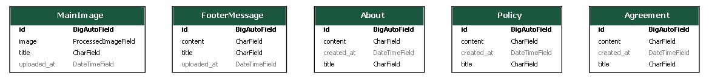
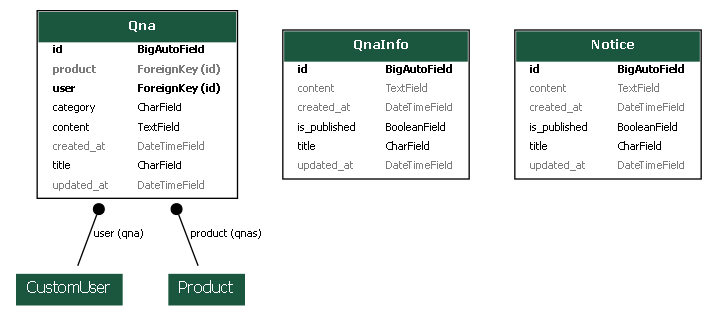
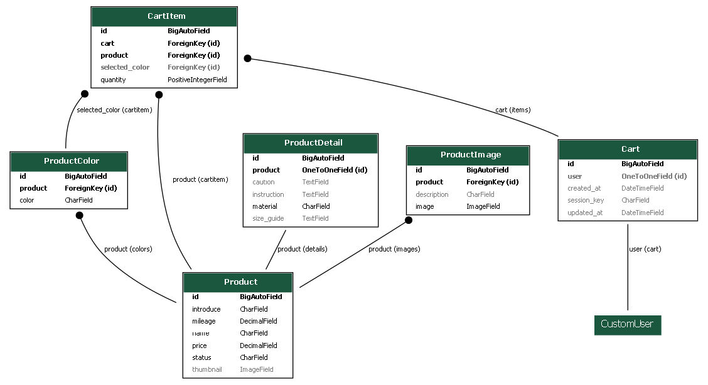
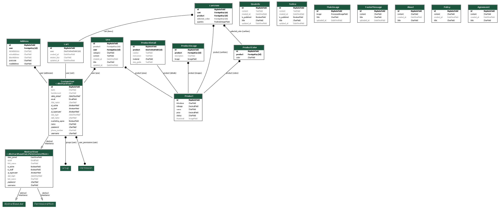

# [Lepond](https://lepond.kr)

## 📌 프로젝트 개요

개발자가 아닌 사람도 홈페이지 및 상품을 관리할 수 있는 쇼핑몰을 구현 중입니다.

## 1. 기능 

### 1. 회원 관리

- 사용자 회원가입 및 로그인  
- 회원정보 수정, 탈퇴 (예정)  
- 마케팅 수신 동의 여부 저장  
- 관리자 페이지 접근 제어  
- 유저별 다중 주소 설정 및 기본 주소 설정(예정)
- 구매 내역(예정)
- 배송 조회(예정)
- 마이 페이지(Order, Cart, Profile, Address, MyCommunity, Contact)
---

### 2. 상품 기능

- 상품 리스트 페이지  
- 상품 상세 페이지  
  - 썸네일 이미지  
  - 옷 상세 설명  
  - 가격  
  - 재고  
  - 사이즈 옵션  
  - 컬러 옵션  
  - 구매 이력 있는 사용자 기준 별점 옵션(예정)
- 상품별 리뷰
  - 리뷰 리스트(예정)
  - 구매 이력 있는 사용자 기준 및 리스트 작성(예정)
- 상품별 Q&A 게시판  
  - 관리자 답변 여부 및 답변(예정)  

---

### 3. 게시판 시스템

- **공지사항 (Notice)**  
  - 관리자 작성
  - 공지사항 조회수(예정)  
- **리뷰 (Review)**  
  - 로그인 사용자만 작성 가능  
  - 별점 포함 (예정)  
- **문의사항 (Q&A)**  
  - 비공개/공개 설정 가능 (예정)  
  - 관리자 답변 기능 제공 (예정)  

---

### 4. 관리자 기능

- 상품 등록 / 수정 / 삭제  
- 상품 카테고리 설정  
- 사용자 Q&A 답변  
- 리뷰 및 문의 모니터링  

---

### 5. 장바구니 기능 **(개발 예정)**

- 로그인 사용자별 장바구니 저장  
- 수량 변경 및 선택 삭제 
- 장바구니에서 결제 연동  

---

### 6. 주문 및 결제 시스템 **(개발 예정)**

- 주문서 작성 및 결제 수단 선택  
- 결제 완료 후 주문 내역 저장 및 재고 차감  
- 주문 상태 확인  
  - 결제 완료 / 배송 조회  
- 주문 취소 및 환불 처리  

---

## 2. Version

- ### Backend
  - Django 4.2.20
  - Python 3.11.9

- ### Database
  - Maria 11.7.2

- ### DevOps / Infra
  - Docker 28.0.4
  - Docker Compose 2.34.0
  - Gunicorn 23.0.0
  - Nginx 1.27.4
  - AWS EC2 (Ubuntu 22.02)
  - AWS S3
  - AWS Route 53

- ### API
  - Solapi AlimTalk API
  - daum 도로명 주소 API

## 3. 구조

---

### `accounts/`
- 사용자 인증
- 회원 가입 / 로그인
- 주소지 설정
- 내 Q&A 모아보기
- 내 Review 모아보기
- 회원 정보 수정

---

### `shop/`
- 상품 리스트 (Product List)
- 상품 상세 (Product Detail)
- 상품 이미지 및 썸네일 (Product Image / Thumbnails)
- 색상 (Color), 상태 (Status), 소재 (Material), 주의사항 (Caution)
- 상품 설명 (Content)
- 상품 후기 (Review)
- 상품 문의 (Q&A)
- 사용자 평점 (User Rating)

---

###  `main/`
- 개인정보 처리방침 (Privacy)
- 인스타그램 연동 (Instagram)
- About Lepond
- Contact
- 메인 이미지 (Main Image)
- 푸터 메시지 (Footer Message)
- 메시지 프레임워크 (Message Framework)

---

### `community/`
- 공지사항 (Notice)
- Q&A 리스트
- Q&A 작성
- 리뷰 리스트
- 리뷰 상세

---

### `payments/` **(예정)**
- 결제 기능 구현 예정

---

### `carts/` **(예정)**
- 장바구니 기능 구현 예정

---

### `templates/`
- `base.html`  
  - 기본 템플릿  
- `product.html`  
  - 상품 전용 템플릿  
  - 이미지가 길어서 스크롤이 필요한 페이지에서 상속(프로덕트 리스트, 프로덕트 디테일)

## 5. ERD

### 메인 ERD

admin페이지에서 메인 이미지, FooterMessage등을 변경 가능
봄에는 노란 꽃 이미지, 여름엔 좀 시원해보이는 걸로, 가을에는 낙엽, 겨울에는 하얗게
FooterMessage는 배송이 지연되거나 명절 때 이용할 계획(ex 추석 명절로 ~~~날 부터 배달 시작됩니다) 

### 유저 ERD

유저별 구매 내역, 배송 조회 기능 추가 예정정

### 샵 ERD

### 커뮤니티 ERD

### 프로젝트 ERD

**payments, carts 추가 예정**

## 6. Superuser
관리자 계정 및 테스트용 구매자 계정 정보
[관리자 페이지](https://www.lepond.kr/admin) 
ID : admintest
PW : lepondtest123!

## 7. 개발 기간 및 일정
개발 기간: 2024.12 ~ 2025.09 (9개월 목표)

## 8. 개선 예정 사항

총 비용
EBS 확장 약 10,000
Domain ITEasy 1년 12,660
EC2 월 약 49,900

Solapi 선불 30,000원 충전
Solapi 카카오톡 발송 비용(회원 가입, 발송, 결제 완료)건당 13원
Solapi 카카오톡 광고 비용 건당 19원

EC2 + EBS + S3 + 도메인 + 알림톡등을 모두 합산하면, 월 기본 유지비만 약 5만 원 이상 발생하고, 알림톡 사용량에 따라 6~7만 원을 넘어설 수도 있음
(아직 실제 운영하지 않아 예측이 불가......)

처음 예상했던 비용보다 실제 운영비가 더 높게 나왔고,
Cafe24보다 저렴하지 않음....

아마 제일 돈이 많이 나가는 EC2를 AWS Lightsail로 갈아타야 될듯.
정말 만약에 너무 잘되면 다시 EC2로 옮길 예정

- 썸네일 옷 이미지 600 * 800으로 고정 예정
- 이미지 파일은 850 * 600으로 고정 예정(길게 나와야 이쁨)

 
- 페이지 렌더링 지연시 Bootstrap Spinner추가 예정
- 404.page, 50x page등 에러시 페이지 개선 예정
- 